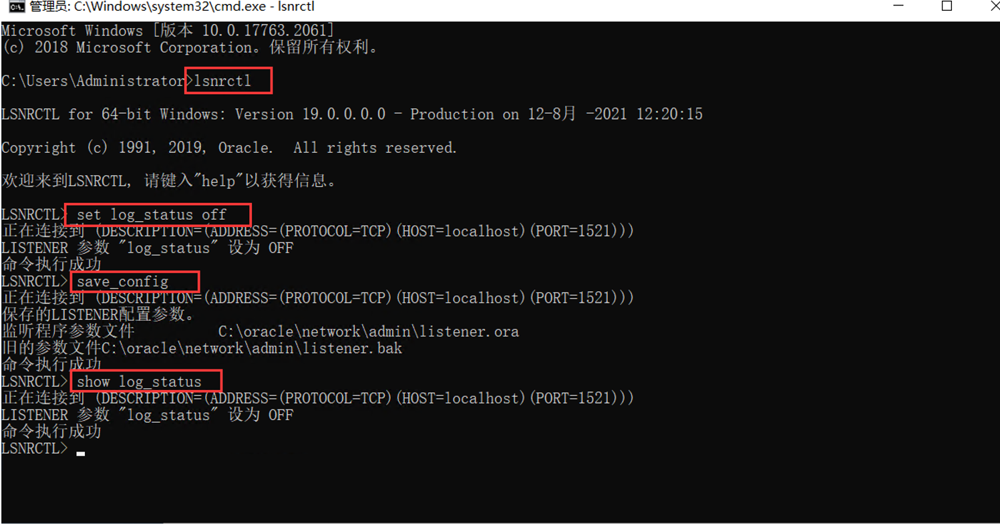
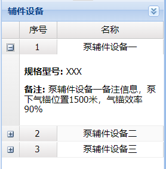
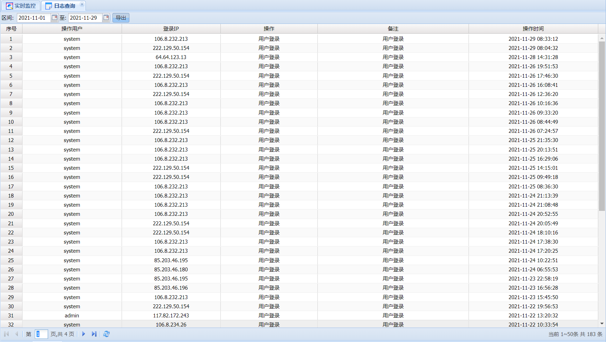
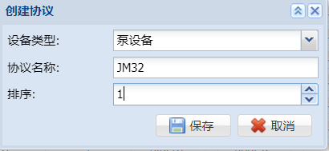
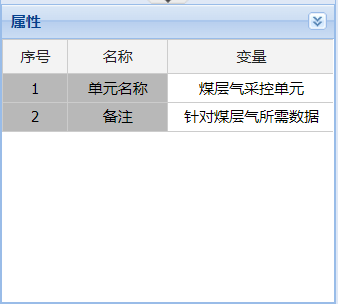

**用 户 手 册**

**目 录**

[第1章 系统介绍](#第1章系统介绍)

>   [1.1 环境要求](#1.1环境要求)

>   [1.2 系统安装](#1.2系统安装)

>   [1.3 系统配置](#1.3系统配置)

>   [1.4 操作流程](#1.4操作流程)

[第2章 应用介绍](#第2章应用介绍)

>   [2.1 页面布局](#2.1页面布局)

>   [2.2 实时监控](#2.2实时监控)

>   [2.2.1 状态统计](#2.2.1状态统计)

>   [2.2.2 设备概览](#2.2.2设备概览)

>   [2.2.3 实时曲线](#2.2.3实时曲线)

>   [2.2.4 实时数据](#2.2.4实时数据)

>   [2.2.5 设备信息](#2.2.5设备信息)

>   [2.2.6 设备控制](#2.2.6设备控制)

>   [2.2.7 资源监测](#2.2.7资源监测)

>   [2.3 历史查询](#2.3历史查询)

>   [2.3.1 设备列表](#2.3.1设备列表)

>   [2.3.2 历史曲线](#2.3.2历史曲线)

>   [2.3.4 历史数据列表](#2.3.4历史数据列表)

>   [2.4 故障查询](#2.4故障查询)

>   [2.4.1 通信状态报警](#2.4.1通信状态报警)

>   [2.4.2 数据量报警](#2.4.2数据量报警)

>   [2.4.3 枚举量报警](#2.4.3枚举量报警)

>   [2.4.4 开关量报警](#2.4.4开关量报警)

>   [2.5 日志查询](#2.5日志查询)

>   [2.5.1 设备日志](#2.5.1设备日志)

>   [2.5.2 系统日志](#2.5.2系统日志)

>   [2.6 权限管理](#2.6权限管理)

>   [2.6.1 单位管理](#2.6.1单位管理)

>   [2.6.2 角色管理](#2.6.2角色管理)

>   [2.6.3 用户管理](#2.6.3用户管理)

>   [2.7 驱动配置](#2.7驱动配置)

>   [2.7.1 驱动配置](#2.7.1驱动配置)

>   [2.7.2 单元配置-采控单元](#2.7.2单元配置-采控单元)

>   [2.7.3 单元配置-报警单元](#2.7.3单元配置-报警单元)

>   [2.7.4 实例配置-采控实例](#2.7.4实例配置-采控实例)

>   [2.7.5 实例配置-报警实例](#2.7.5实例配置-报警实例)

>   [2.7.6 实例配置-短信实例](#2.7.6实例配置-短信实例)

>   [2.8 设备管理](#2.8设备管理)

>   [2.8.1 泵设备](#2.8.1泵设备)

>   [2.8.2 管设备](#2.8.2管设备)

>   [2.8.3 辅件设备](#2.8.3辅件设备)

>   [2.9 系统配置](#2.9系统配置)

>   [2.9.1 模块配置](#2.9.1模块配置)

>   [2.9.2 字典配置](#2.9.2字典配置)

>   [2.9.3 报警颜色](#2.9.3报警颜色)

## <h1>第1章 系统介绍</h1>  

## <h2>1.1 环境要求</h2>

CPU：2核及以上

内存：8G及以上

硬盘：1T及以上

操作系统：建议Windows server 2012 64位及以上（推荐：Windows server 2019）

数据库：Oracle 12g及以上

JDK：8.0及以上

Tomcat：9.0及以上

## <h2>1.2 系统安装</h2>

1、正确安装并配置jdk(版本：1.8)、tomcat(版本：9.0)、oracle(版本：12g及以上)。

注意：随着系统的运行，oracle的日志文件会越来越大，当达到4G时，会影响到数据库的正常运行，可以选择关闭oracle日志文件的生成，操作方法如下。

运行“cmd”，打开命令窗口，依次执行以下命令进行关闭oracle日志操作：

1）lsnrctl

2）set log_status off

3）save_config

4）show log_status

2、创建数据库

1）打开《数据库》文件夹下《createDB》文件夹，打开1、createSpaceAndUser.sql文件，按照实际情况修改其中表空间及用户的信息

2）编辑批处理文件autorun.bat中的数据库连接信息，保存关闭后执行，执行完毕后按任意键退出，数据库创建完毕

1.  管理员用户名/密码@数据库实例名

2.  自建的用户名/密码@数据库实例名

3、软件部署：打开
“1、软件”目录，将《ad.exe》程序拷贝到服务器中（路径自定义）；将《ap\_fb.rar》解压到tomcat安装目录\\webapps文件夹下。

4、端口开放

必开放端口，如有改变按实际情况执行：

1）16100：平台web访问端口；

2）19100：驱动程序主站端口，用于设备连接；

3）19200：驱动程序端口；

可开放端口，如有改变按实际情况执行

1）3389：远程桌面连接端口

2）1521：oracle数据库端口

## <h2>1.3 系统配置</h2>

同步修改tomcat安装目录\\webapps\\ap\_fb\\WEB-INF\\config\\config.yml和tomcat安装目录\\webapps\\ap\_fb\\WEB-INF\\classes\\config\\config.yml文件，配置项如下：

1、软件访问路径配置

>   

2、数据库连接配置

一般只需修改IP、端口、数据库实例名、用户名、密码即可。

注意：对于oracle12c及以上版本，端口后是”/”，而不是”:”，如jdbc:oracle:thin:@127.0.0.1:1521/orcl

3、软件名称及简介配置

4、驱动程序路径配置，只需将IP修改位ad程序所在服务器IP即可

5、配置完成成后，启动驱动程序，启动tomcat。启动后，打开浏览器，访问并登录软件，按照1.5节说明进行操作。

## <h2>1.4 操作流程</h2>

系统部署完成后需要根据使用者实际情况进行数据配置，流程如下：

1、输入默认的软件管理员账号进入系统；

2、“单位管理”模块创建单位信息，**详情查看2.6.1节**；

3、“用户管理”模块为单位创建用户，**详情查看2.6.3节**；

4、“驱动配置”模块配置协议或者对接数据库的信息，**详情查看2.7节**；

5、“设备管理”模块录入设备信息，**详情查看2.8节**；

## <h1>第2章 应用介绍</h1>  

浏览器要求：建议谷歌浏览器、360浏览器极速模式、IE9以上版本。

## <h2>2.1 页面布局</h2>

1、banner区：包括修改密码、退出、帮助及全屏按钮；

2、功能导航区：系统各主功能模块；

3、组织导航区：用户组织结构；

4、模块详细功能。

通过点击界面中缝位置的图标或可实现界面伸缩。

图2-1 界面概览

## <h2>2.2 实时监控</h2>

根据设备数据进行实时监控，**有新数据时，界面自动刷新。**

图2-2 实时监控

### <h3>2.2.1 状态统计</h3>

统计设备通信状态，点击饼图相应部分或者统计表中某一行，可对设备进行状态筛选。

图2-3 实时监控-状态统计饼图 图2-4 实时监控-状态统计表

### <h3>2.2.2 设备概览</h3>

显示设备列表及最新采集数据，动态实时刷新，并可将数据导出。

图2-5 实时监控-设备概览

### <h3>2.2.3 实时曲线</h3>

实时曲线，动态实时刷新。曲线中的内容可在驱动配置-单元配置-采控单元中配置。实时曲线只能查看当天数据，可点击时间区域显示对应曲线。

图2-6 实时监控-实时曲线

### <h3>2.2.4 实时数据</h3>

显示概览表中所选设备的实时数据及报警，动态实时刷新。

图2-7 实时监控-实时数据

### <h3>2.2.5 设备信息</h3>

显示设备基本信息以及辅件信息。

设备信息：在设备管理部分录入

图2-8 实时监控-设备信息

辅件设备：在辅件设备管理中录入，并在相应的设备管理模块中配置主设备所具备的辅件设备。

图2-9 实时监控-辅件设备

### <h3>2.2.6 设备控制</h3>

根据设备配置的采控数据，动态显示控制项，点击按钮进行相应的控制。

**注意：当前登录用户拥有控制权限且目标设备在线时，才可进行控制**。

图2-10 实时监控-设备控制

### <h3>2.2.7 资源监测</h3>

实时监测服务器的CPU、内存使用情况，数据库表空间使用率以及驱动程序运行状态和版本信息，点击可查看历史曲线。

图2-11 实时监控-资源监测

## <h2>2.3 历史查询</h2>

查询设备历史数据

图2-12 历史查询

### <h3>2.3.1 设备列表</h3>

显示设备列表以及当前通信状态和最新数据的采集时间。

图2-13 历史查询-设备列表

### <h3>2.3.2 历史曲线</h3>

显示数据列表中所选设备的历史曲线，当历史数据记录数大于500时，显示数据抽稀后的曲线。

图2-14 历史查询-历史曲线

### <h3>2.3.4 历史数据列表</h3>

显示设备列表所选设备的历史数据，历史数据表中为设备概览数据，点击详细查看详细数据。

图2-15 历史查询-概览数据历史

图2-7 历史查询-详细数据

## <h2>2.4 故障查询</h2>

查询设备报警信息，包括通信状态报警、数据量报警、枚举量报警、开关量抱紧。

### <h3>2.4.1 通信状态报警</h3>

查询设备上线、离线报警数据。

图2-16 故障查询-通信状态报警

### <h3>2.4.2 数据量报警</h3>

查询设备数据量数据的报警信息。

图2-17 故障查询-数据量报警

### <h3>2.4.3 枚举量报警</h3>

查询设备枚举量数据的报警信息。

图2-18 故障查询-枚举量报警

### <h3>2.4.4 开关量报警</h3>

查询设备开关量数据的报警信息。

图2-19 故障查询-开关量报警

## <h2>2.5 日志查询</h2>

日志数据查询，包括设备日志和系统日志。

### <h3>2.5.1 设备日志</h3>

查询设备操作日志，如设备的添加、修改、删除和控制。

图2-20 日志查询-设备日志

### <h3>2.5.2 系统日志</h3>

查询用户登录时间、登录IP等。

图2-21 日志查询-系统日志

## <h2>2.6 权限管理</h2>

系统部署完成后需要新建单位、用户并划分权限。

### <h3>2.6.1 单位管理</h3>

单位组织维护，创建及编辑组织树。

图2-22 单位管理

#### <h4>2.6.1.1 单位创建</h4>

（1）点击“创建”按钮，创建油田公司。

上级单位：选择上级单位，无上级单位则选择“组织根节点”；

单位类别：按实际选择，如局级；

单位名称：油田公司；

单位编码、单位级别：确定上级单位、单位类别后自动生成；

单位说明：单位详细说明，可不填写。

填写完成后，点击“保存”按钮，完成创建。

图2-23单位管理-单位创建

#### <h4>2.6.1.2 单位修改</h4>

选中要修改的组织，点击“修改”按钮（或者双击）打开修改窗口，编辑相应内容后，点击“修改”按钮，完成操作。

图2-24单位管理-单位修改

#### <h4>2.6.1.3 单位删除</h4>

勾选要删除的组织，点击“删除”按钮

图2-25 单位管理-单位删除

### <h3>2.6.2 角色管理</h3>

图2-26 角色管理

#### <h4>2.6.2.1 角色创建</h4>

点击“创建”按钮，创建角色

角色名称：角色名称；

角色编码：角色的编码；

控制权限：角色是否具有设备控制权限；

接收报警短信：是否接收设备报警短信；

接收报警邮件：是否接收设备报警邮件；

数据显示级别：只能查看显示级别大于角色数据显示级别的数据项，对设备数据进行分级管理；

角色描述：角色信息描述；

图2-27 角色管理-角色创建

#### <h4>2.6.2.2 角色修改</h4>

选中要修改的角色，点击“修改”按钮（或者双击）打开修改窗口，编辑相应内容后，点击“修改”按钮，完成操作。

图2-28 角色管理-角色修改

#### <h4>2.6.2.3 角色删除</h4>

勾选要删除的角色，点击“删除”按钮

图2-29 角色管理-角色删除

#### <h4>2.6.2.4 角色授权</h4>

选中要授权的角色，在右侧模块表中勾选要授予给角色的模块，点击“保存”。

图2-30 角色管理-角色授权

### <h3>2.6.3 用户管理</h3>

#### <h4>2.6.3.1 用户创建</h4>

点击“创建”按钮，创建新用户。填写完成后，点击“保存”按钮，完成创建。

单位名称：选择用户所属组织；

角色：选择要授予的角色，则该用户获得所授予的角色具备的权限；

用户名称、用户账号、用户密码：按实际填写；

快捷登录：在登录界面是否可以免密登录，一般用于数据查询人员。

用户电话：用于接收报警短信；

内部邮箱：用于接收报警邮件；

图2-31 用户创建

#### <h4>2.6.3.2 用户修改</h4>

选中要修改的用户，点击“修改”按钮（或者双击）打开修改窗口，编辑相应内容后，点击“修改”按钮，完成操作。

#### <h4>2.6.3.3 用户删除</h4>

勾选要删除的用户，点击“删除”按钮。

## <h2>2.7 驱动配置</h2>

包括协议配置、单元配置、实例配置。

### <h3>2.7.1 驱动配置</h3>

图2-32 协议配置配置

#### <h4>2.7.1.1 协议列表</h4>

第一层节点：协议所属设备类型，泵设备或管设备；

第二层节点：协议；

图2-29 协议列表

#### <h4>2.7.1.2 协议属性</h4>

树形列表中所选协议的属性，可在此处进行查看和修改。

图2-33协议属性窗口

#### <h4>2.7.1.3 协议地址配置</h4>

协议下具体地址配置，在此处进行添加（右键插入）、修改（单元格直接编辑）、删除（右键删除）。修改后点击保存按钮。（支持从excel中粘贴）

图2-34 协议地址配置

名称：项名称；

地址：项起始地址；

数量：所配置的存储数据类型数量，如1个uint16；

存储数据类型：设备中存储该项数据的数据类型，包括：byte、int16（有符号16位整型）、uint16（无符号16位整型）、float32（32位浮点）、bcd（bcd码，时间一般配置为该类型）；

接口数据类型：上位机要解析成的数据类型，包括bool（布尔型）、int（整型）、float32（32位浮点）、float64（64位浮点）、string（字符串），位数组接口数据类型固定选择bool型；

单位：上位机解析后的单位（和界面显示一致）；

换算比例：存储数据\*换算比例=接口数据；

解析模式：数据量、枚举量、开关量；

采集模式：主动上传（设备主动上传）、被动相应（设备被动等待上位机读写）。

#### <h4>2.7.1.4 项含义配置</h4>

枚举量：如变频器运行状态值对应的含义配置

图2-35 枚举量含义配置

开关量：如保护开关位数组，位所对应的开关状态

图2-36 开关量位含义配置

数据量：如井口温度，将值-50设置为无效数据N/A

图2-37 数据量显示转换配置

#### <h4>2.7.1.5 协议添加及删除</h4>

1、协议添加

点击“添加协议”按钮，添加协议

图2-38 协议添加

协议添加后，再配置协议的地址信息。

2、协议删除

在协议列表中，选中要删除的协议，右键→删除协议。

图2-39 协议删除

### <h3>2.7.2 单元配置-采控单元</h3>

在协议下面创建采控单元，每个采控单元下面可以创建一个采集组和一个控制组，并勾选采集组和控制组包含的项。

图2-40 采控单元

#### <h4>2.7.2.1 单元列表</h4>

第一层节点：设备类型，泵设备或管设备

第二层节点：协议；

第三层节点：采控单元；

第四层节点：采集组或者控制组；

图2-41 采控单元列表

#### <h4>2.7.2.2 属性</h4>

1、采控单元属性

树形列表中所选采控单元的属性，可在此处进行查看和修改。

图2-42采控单元属性窗口

2、采集组属性

树形列表中所选采集组的属性，可在此处进行查看和修改。

采集周期：针对被动相应数据生效，上位机采集周期；

保存周期：历史数据保存周期；

图2-43采集组属性窗口

3、控制组属性

树形列表中所选控制组的属性，可在此处进行查看和修改。

图2-44控制组属性窗口

#### <h4>2.7.2.3 组包含项配置</h4>

1、采集组包含的采集项配置

左侧树形列表中选择要配置的采集组，在采控项配置列表中勾选包含的采集项；

显示级别：采集项显示级别，用户只能查看显示级别不小于自身数据显示级别的数据（见角色管理和用户管理）；

显示顺序：对应实时监控模块中实时数据表和历史查询模块中详细数据表中项的显示顺序（左到右、上到下顺序），未设置顺序的项将放在最后面显示；

实时曲线：实时曲线显示顺序，未设置则不显示曲线；

历史曲线：历史曲线显示顺序，未设置则不显示曲线；

图2-45采集组包含采集项配置

2、控制组包含的控制项项配置

左侧树形列表中选择要配置的控制组，在采控项配置列表中勾选包含的控制项（读写类型为只写或者读写）；

显示级别：控制项显示级别，用户只能查看显示级别不小于自身数据显示级别的数据（见角色管理和用户管理）；

显示顺序：对应实时监控模块中控制列表中控制项的显示顺序；

图2-46控制组包含控制项配置

#### <h4>2.7.2.4 创建和删除采控单元</h4>

1、创建采控单元

点击“添加采控单元”按钮，进行采集单元的创建。

协议名称：在下拉框中选择所属协议；

单元名称：单元名称；

单元描述：单元描述；

图2-47创建采控单元

2、删除采控单元

在左侧树形菜单中选中要删除的单元，右键→删除采控单元。

图2-48删除采控单元

#### <h4>2.7.2.4 创建和删除采控组</h4>

1、创建采控组

点击“添加采控组”按钮，进行采集组的创建。

协议名称：在下拉框中选择所属协议；

单元名称：在下拉框中选择所属单元；

组名称：组名称；

组类型：采集组或者控制组

采集周期：采集组填写

保存周期：采集组填写

组描述：组描述。

图2-49创建采控组

2、删除采控组

在左侧树形菜单中选中要删除的组，右键→删除采控组。

图2-50删除采控组

### <h3>2.7.3 单元配置-报警单元</h3>

在协议下面创建报警单元，并设置单元下包含的报警项及报警配置。

图2-51 报警单元

#### <h4>2.7.3.1 单元列表</h4>

第一层节点：设备类型，泵设备或管设备

第二层节点：协议；

第三层节点：报警单元；

#### <h4>2.7.3.2 单元属性</h4>

树形列表中所选报警单元的属性，可在此处进行查看和修改。

图2-52报警单元属性窗口

#### <h4>2.7.3.3 单元包含报警项配置</h4>

左侧树形列表中选择要配置的报警，分别配置数据量、开关量、枚举量、通信状态报警项；

1、数据量报警项配置

勾选单元包含的数据量报警项，并设置

上限：报警上限；

下限：报警下限；

回差：值大于上限和回差的和或者小于下限和回差的差值则报警；

延时：延时时间内不重复报警和推送；

报警级别：正常、一级报警、二级报警、三级报警（一级为最紧急严重）；

报警使能：使能或者失效（失效则一律不报警）；

是否发送短信：报警发生时是否向用户发送短信（建议一级报警项设为是，其他为否，避免频繁发送）；

是否发送右键：报警发生时是否向用户发送邮件（建议一级报警项设为是，其他为否，避免频繁发送）；

图2-53数据量报警项配置

2、开关量报警项配置

选中要设置报警的开关量数据，并设置

触发状态：开或者关触发报警；

延时：延时时间内不重复报警和推送；

报警级别：正常、一级报警、二级报警、三级报警（一级为最紧急严重）；

报警使能：使能或者失效（失效则一律不报警）；

是否发送短信：报警发生时是否向用户发送短信（建议一级报警项设为是，其他为否，避免频繁发送）；

是否发送右键：报警发生时是否向用户发送邮件（建议一级报警项设为是，其他为否，避免频繁发送）；

图2-54开关量报警项配置

3、枚举量报警项配置

勾选单元包含的枚举量报警项，并设置

延时：延时时间内不重复报警和推送；

报警级别：正常、一级报警、二级报警、三级报警（一级为最紧急严重）；

报警使能：使能或者失效（失效则一律不报警）；

是否发送短信：报警发生时是否向用户发送短信；

是否发送右键：报警发生时是否向用户发送邮件；

图2-55枚举量报警项配置

4、通信状态报警项配置

勾选单元包含的通信状态报警项，并设置

延时：延时时间内不重复报警和推送；

报警级别：正常、一级报警、二级报警、三级报警（一级为最紧急严重）；

报警使能：使能或者失效（失效则一律不报警）；

是否发送短信：报警发生时是否向用户发送短信；

是否发送右键：报警发生时是否向用户发送邮件；

图2-56通信状态报警项配置

### <h3>2.7.4 实例配置-采控实例</h3>

在采控单元中配置完采控单元后（确定采控项和地址配置），还需配置采控实例（读写一级解析时具体的协议）。

图2-57采控实例配置

#### <h4>2.7.4.1 实例列表</h4>

第一层节点：设备类型，泵设备或管设备

第二层节点：采控实例；

第三层节点：采控实例配置的采控单元；

第四层节点：采控实例配置的采控单元下的采控组；

图2-58采控实例列表

#### <h4>2.7.4.2 实例属性</h4>

树形列表中所选采控实例的属性，可在此处进行查看和修改。

图2-59采控实例属性窗口

#### <h4>2.7.4.2 创建和删除实例</h4>

1、创建实例

点击“添加实例”按钮，进行创建。

实例名称：实例名称；

设备类型：泵设备或者管设备

采控单元：在下拉框中选择对应的采控单元；

采集协议类型：数据采集及解析具体协议，目前支持private-kd93（科台斯）、private-lq1000（灵旗）、modbus-tcp、modbus-rtu四种协议；

控制协议类型：设备控制具体协议，目前支持modbus-tcp、modbus-rtu两种协议；

注册包前缀：注册包设备上线时发送的信息，如没有则不填写；

注册包后缀：如没有则不填写；

心跳包前缀：用于判断设备连接状态，如没有则不填写；

心跳包后缀：如没有则不填写；

排序：实例排序序号，对应树形列表中实例显示顺序。

图2-60创建采控实例

2、删除实例

在左侧树形菜单中选中要删除的实例，右键→删除采控实例。

图2-61删除采控实例

### <h3>2.7.5 实例配置-报警实例</h3>

在报警单元中配置完报警单元后，还需配置报警实例。

图2-62报警实例配置

#### 2.7.5.1 实例列表
#### <h4>2.7.4.2 创建和删除实例</h4>

第一层节点：设备类型，泵设备或管设备

第二层节点：报警实例；

第三层节点：报警实例配置的报警单元；

图2-63报警实例列表

#### 2.7.5.2 实例属性
#### <h4>2.7.4.2 创建和删除实例</h4>

树形列表中所选报警实例的属性，可在此处进行查看和修改。

图2-64采控实例属性窗口

#### <h4>2.7.4.3 创建和删除实例</h4>

1、创建实例

点击“添加实例”按钮，进行创建。

实例名称：实例名称；

设备类型：泵设备或者管设备

报警单元：在下拉框中选择对应的报警单元；

排序：实例排序序号，对应树形列表中实例显示顺序。

图2-65创建报警实例

2、删除实例

在左侧树形菜单中选中要删除的实例，右键→删除报警实例。

图2-66删除报警实例

### <h3>2.7.6 实例配置-短信实例</h3>

配置短信设备实例

实例名称：实例名称

采集协议类型：目前支持private-lq1000协议

控制协议烈性：目前支持private-lq1000协议

图2-67短信实例

## <h2>2.8 设备管理</h2>

### <h3>2.8.1 泵设备</h3>

泵设备共包括隔膜泵、螺杆泵、直线电机泵、电潜泵、射流泵五种

单位名称：设备所属单位，和组织树中对应；

井名：井名；

应用场景：煤层气井或者油井；

采控实例：对应驱动配置/实例配置/采控实例中配置的实例；

报警实例：对应驱动配置/实例配置/报警实例中配置的实例；

注册包ID：上位机通过注册包ID和设备从地址区分设备；

设备从地址：上位机通过注册包ID和设备从地址区分设备；

出厂编号、规格型号、生产日期、发货日期、投产日期、控制柜型号等设备信息

排序编号：设备显示顺序；

辅件设备配置：在辅件设备列表中，勾选左侧设备表中所选设备具有的辅件设备。

辅件设备的维护见“2.8.3辅件设备”部分。

注意：当需要修改设备名称时，修改后，不要点击“保存”按钮，而是点击“修改设备名称”按钮。

图2-68 泵设备管理

### <h3>2.8.2 管设备</h3>

管设备共包括加热管、采水管、集输管五种

单位名称：设备所属单位，和组织树中对应；

井名：井名；

应用场景：煤层气井或者油井；

采控实例：对应驱动配置/实例配置/采控实例中配置的实例；

报警实例：对应驱动配置/实例配置/报警实例中配置的实例；

注册包ID：上位机通过注册包ID和设备从地址区分设备；

设备从地址：上位机通过注册包ID和设备从地址区分设备；

出厂编号、规格型号、生产日期、发货日期、投产日期、控制柜型号、管体长度等设备信息

排序编号：设备显示顺序；

辅件设备配置：在辅件设备列表中，勾选左侧设备表中所选设备具有的辅件设备。

辅件设备的维护见“2.8.3辅件设备”部分。

注意：当需要修改设备名称时，修改后，不要点击“保存”按钮，而是点击“修改设备名称”按钮。

图2-69 管设备管理

### <h3>2.8.3 辅件设备</h3>

辅件设备管理

设备名称：设备名称；

类型：泵辅件或者管辅件；

规格型号：规格型号；

备注：备注信息；

排序编号：设备显示顺序；

注意：当需要修改设备名称时，修改后，不要点击“保存”按钮，而是点击“修改设备名称”按钮。

图2-70 辅件设备管理

## <h2>2.9 系统配置</h2>

### <h3>2.9.1 模块配置</h3>

配置模块信息。

图2-71 模块配置

### <h3>2.9.2 字典配置</h3>

对各模块显示的字段进行管理，主要修改字段名称、显示顺序、是否显示等。如“泵设备实时概览”（即实时监控模块中泵设备概览表）中显示哪些内容，可点击对应字典项，并在里面进行勾选。

图2-72 字典配置

### <h3>2.9.3 报警颜色</h3>

设置概览数据表、详细数据表以及状态统计中各级别报警的提示颜色。

图2-73 报警配置
